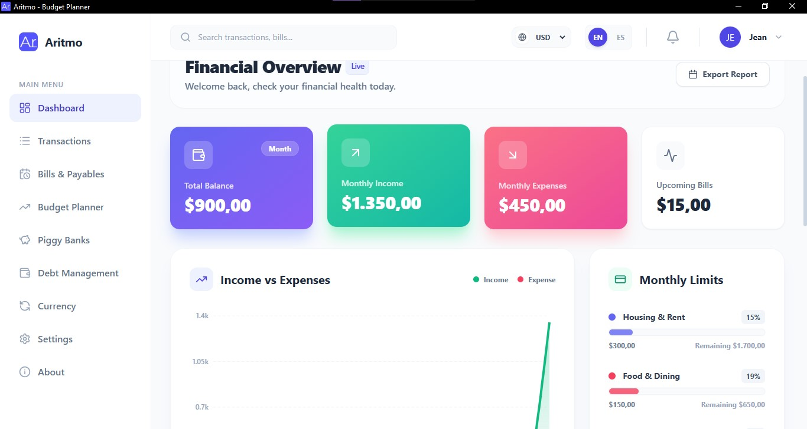

#       Aritmo Budget Planner

A powerful, privacy-focused desktop application for personal finance management. Built with modern web technologies and wrapped in Electron, Aritmo runs locally on your machine, ensuring your financial data remains secure and private.

## Features

- **Interactive Dashboard**: Visual overview of your financial health with dynamic charts.
- **Transaction Management**: Easily record and categorize income and expenses.
- **Bill Tracking**: Keep track of recurring bills, due dates, and payment status.
- **Budget Planning**: Set monthly limits for different categories to control your spending.
- **Savings Goals**: Create and track progress towards your financial goals.
- **Debt Manager**: Monitor and plan your debt payoffs effectively.
- **Currency Converter**: Real-time currency conversion tools.
- **Multi-language Support**: Interface available in multiple languages to suit your preference.
- **Privacy First**: All data is stored locally using SQLite. No external servers or tracking.
- **Modern UI**: Clean, responsive interface styled with Tailwind CSS and Lucide icons.

## Screenshots



## Stack

- **Runtime**: [Electron](https://www.electronjs.org/)
- **Frontend**: [React](https://react.dev/) (v19)
- **Build Tool**: [Vite](https://vitejs.dev/)
- **Language**: [TypeScript](https://www.typescriptlang.org/)
- **Styling**: [Tailwind CSS](https://tailwindcss.com/)
- **Database**: [SQLite](https://www.sqlite.org/) (via `better-sqlite3`)
- **Visualization**: [Recharts](https://recharts.org/)
- **Icons**: [Lucide React](https://lucide.dev/)

## External APIs

The application uses the following public APIs for real-time data:

- **Currency Exchange Rates**: [FloatRates](http://www.floatrates.com/) - Provides daily exchange rates for major currencies.
- **Dolar Vzla Rates**: [DolarAPI](https://dolarapi.com/) - Provides specific exchange rates for the database in Venezuela.

## Getting Started

### Prerequisites

- [Node.js](https://nodejs.org/) (v18 or higher recommended)
- [npm](https://www.npmjs.com/)

### Installation

1.  **Clone the repository**
    ```bash
    git clone https://github.com/Jean-EstevezT/Aritmo-Budget-Planner.git
    cd Aritmo-Budget-Planner
    ```

2.  **Install dependencies**
    ```bash
    npm install
    ```

3.  **Run the application (Development)**
    ```bash
    npm run dev:electron
    ```
    This command runs both the Vite dev server and the Electron application concurrently.

4.  **Build for Production**
    ```bash
    npm run electron:dist
    ```

## Developer

**Jean Estevez**
- GitHub: [Jean-EstevezT](https://github.com/Jean-EstevezT)
- Email: ctarriba9@gmail.com

---

## License

This project is licensed under the [GNU GPLv3 License](LICENSE).
